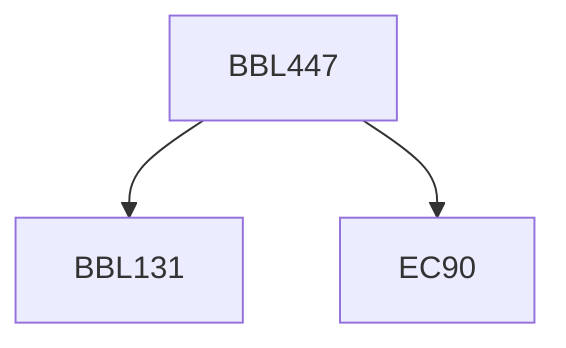

**Credits:** 3 (2-0-2)

**Prerequisites:** [[/Biochemical Engineering and Biotechnology/BBL131|BBL131]] and EC 90

#### Description
Enzymes as biocatalysts. Various reaction media for enzyme catalyzed reaction [water, water poor media such as organic solvents, ionic liquids] and mixed solvents. Advantages of medium engineering. Fundamentals of non-aqueous enzymology [pH memory, molecular imprinting]. Improving biocatalysis in water and water poor media [chemical modification, immobilization, applications of protein engineering/directed evolution]. Enzyme promiscuity and its applications in organic synthesis. Biocatalytic applications in organic synthesis, hydrolytic reactions, oxidation reduction reactions, formation of C-C bond, addition and elimination reactions, glycosyl transfer reactions, isomerization, halogenation/dehalogenation reactions.

### Prerequisite Tree

