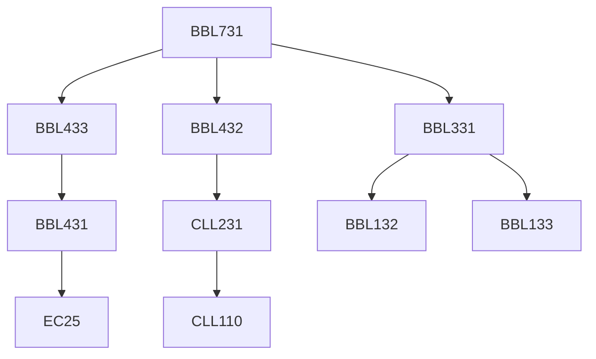

**Credits:** 4.5 (3-0-3)

**Prerequisites:** [[/Biochemical Engineering and Biotechnology/BBL331|BBL331]], [[/Biochemical Engineering and Biotechnology/BBL432|BBL432]], [[/Biochemical Engineering and Biotechnology/BBL433|BBL433]]

#### Description
Revision of mechanical separation (filtration, Centrifugation etc.), cell disruption, Protein precipitation and its separation, Extraction, Adsorption Desorption processes, Chromatographic methods based on size, charge, shape, biological affinity etc., Membrane separations- ultrafiltration and electrodialysis, Electrophoresis, Crystallization, Drying, Case studies. Laboratory: Conventional filtration batch & continuous, Centrifugation in batch and continuous centrifuge, Cell disruption, Protein precipitation and its recovery, Thin Layer Chromatography (TLC), Membrane based filtration-ultrafiltration in cross. Flow modules and microfiltration, electrodialysis, Adsorption Column Studies and Freeze Drying Studies.

Laboratory: Cell disruption through various techniques, Filtration to understand Darcy’s law, Exposure to continuous filtration process, Understanding the centrifugation principles and calculate settling velocity, Adsorption of dyes to understand the break-through curves, Application of solvent extraction principles, Experience in packing the column for gel extraction chromatography, operation of gel filtration chromatography, Hands-on experience on HPLC, Construction of SMB process.

### Prerequisite Tree

