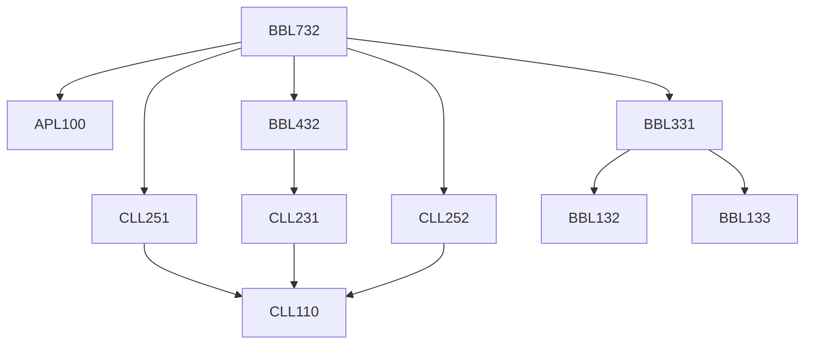

**Credits:** 4 (3-0-2)

**Prerequisites:** [[/Applied Mechanics/APL100|APL100]] [[/Chemical Engineering/CLL251|CLL251]] [[/Chemical Engineering/CLL252|CLL252]] [[/Biochemical Engineering and Biotechnology/BBL331|BBL331]] [[/Biochemical Engineering and Biotechnology/BBL432|BBL432]]

#### Description
Introduction; General design information; Mass and energy balance; Flow sheeting; Piping and instrumentation; Materials of construction for bioprocess plants; Mechanical design of process equipment; Vessels for biotechnology applications; Design considerations for maintaining sterility of process streams and processing equipment; Selection and specification of equipment for handling fluids and solids; Selection, specification and design of heat and mass transfer equipment used in bioprocess industries; Utilities for biotechnology production plants; Process economics; Bioprocess validation; Safety considerations; Case studies.

Laboratory: Design of the complete process plant for an identified product or service. Each student to choose a separate product/industry

### Prerequisite Tree

