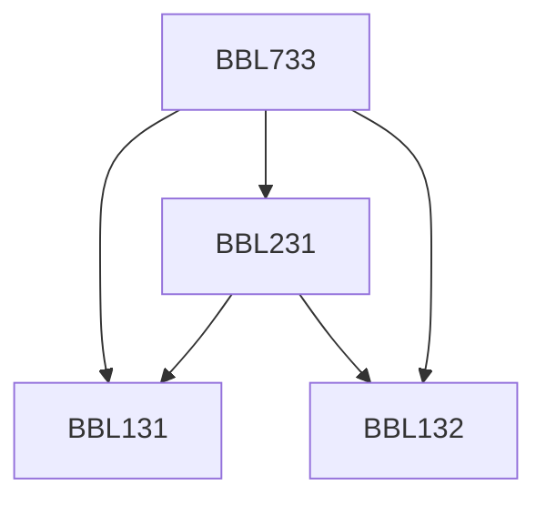

**Credits:** 3.5 (2-0-3)

**Prerequisites:** [[/Biochemical Engineering and Biotechnology/BBL131|BBL131]], [[/Biochemical Engineering and Biotechnology/BBL132|BBL132]], [[/Biochemical Engineering and Biotechnology/BBL231|BBL231]] or Masters’ degree in Bioscience

#### Description
Restriction and other modifying enzymes, Cloning vectors (plasmid, (-based, phagemids, high capacity) and expression vectors, Expression in bacterial, yeast and mammalian systems, Construction of genomic and cDNA libraries, DNA Sequencing, Polymerase chain reaction, Invitro mutagenesis, Genome mapping, Stability of recombinant cells in production of biochemicals.

### Prerequisite Tree

