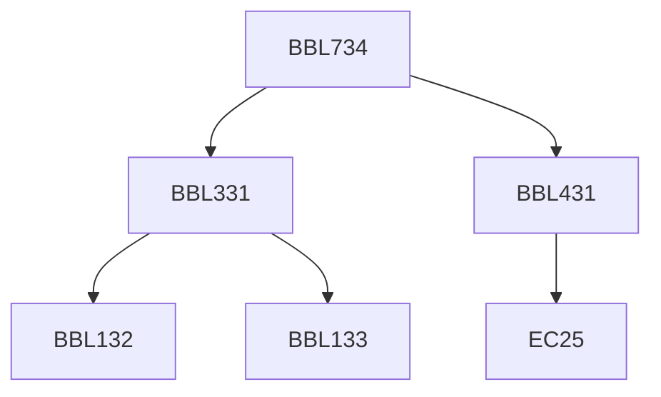

**Credits:** 3 (3-0-0)

**Prerequisites:** [[/Biochemical Engineering and Biotechnology/BBL331|BBL331]], [[/Biochemical Engineering and Biotechnology/BBL431|BBL431]]

#### Description
Regulatory mechanisms for control of enzyme synthesis - an overview; Control of enzyme activity- proteolysis, covalent modification and ligand binding; Metabolic control theory and metabolic flux analysis; Metabolic regulation of a few major metabolic pathways especially those relevant to bioprocess industries; Pathway engineering; Application of gene cloning in re-directing cellular metabolism for over-production of a few industrial products; Strategies to overcome regulatory mechanisms for over-production of several industrially important primary and secondary metabolites such as alcohols, organic acids, amino acids, enzymes and therapeutic compounds.

### Prerequisite Tree

