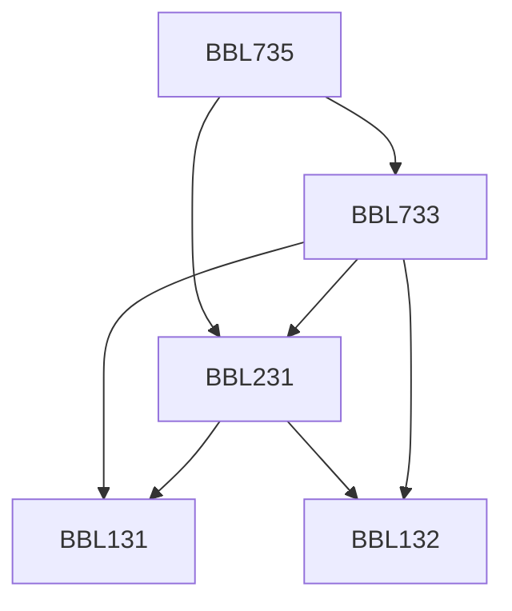

**Credits:** 3 (2-0-2)

**Prerequisites:** [[/Biochemical Engineering and Biotechnology/BBL231 | BBL231]], [[/Biochemical Engineering and Biotechnology/BBL733 | BBL733]]

#### Description 
Introduction to -omes and -omics; GENOMICS - Genome sequencing and assembly; Next-generation sequencing; Studying gene expression and function; High throughput gene expression and analysis. PROTEOMICS - Sample preparation; Separation methods; Mass Spectroscopy and de novo sequencing; Comparative Proteomics; Protein-protein interactions.

### Prerequisite Tree

