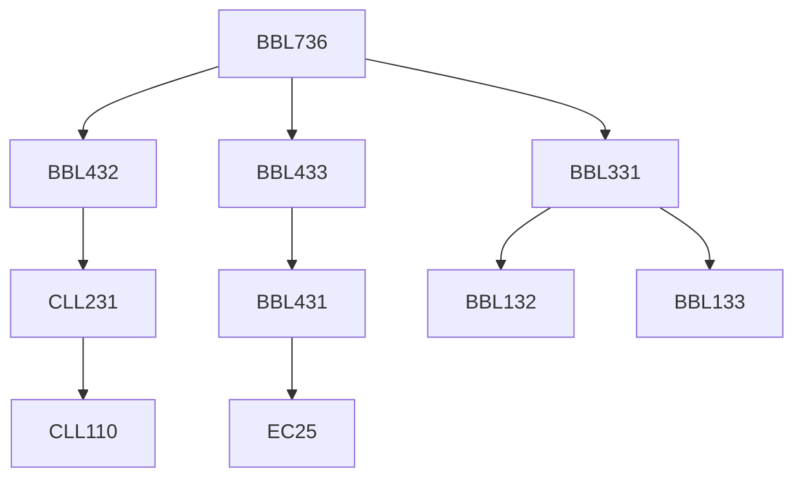

**Credits:** 3 (3-0-0)

**Prerequisites:** [[/Biochemical Engineering and Biotechnology/BBL331 | BBL331]], [[/Biochemical Engineering and Biotechnology/BBL432 | BBL432]], [[/Biochemical Engineering and Biotechnology/BBL433 | BBL433]]

#### Description 
Stability analysis; analysis of multiple interacting microbial populations; stability of recombinant cells; Structured models of gene expression and growth, Cell cycle and age-dependent (segregated) models, Single-cell (stochastic) models of gene expression.

### Prerequisite Tree

