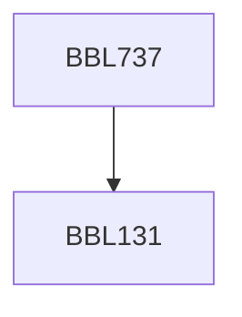

**Credits:** 3 (2-0-2)

**Prerequisites:** [[/Biochemical Engineering and Biotechnology/BBL131|BBL131]]

#### Description
Introduction to methods used in Analytical Bioengineering, Electrophoretic methods, Principles and applications of chromatography (GC, HPLC, FPLC, HPTLC), Spectrophotometry (UV-visible), Fluorescence methods, FTIR, Circular dichroism, Mass spectrometry (GC-MS, LC-MS, ICP-MS), Immunology based analytical methods (ELISA), qPCR, Advanced Microscopy techniques (Electron Microscopy, Confocal Microscopy).

### Prerequisite Tree

