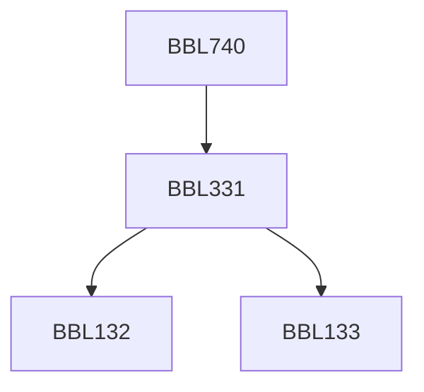

**Credits:** 4 (3-0-2)

**Prerequisites:** [[/Biochemical Engineering and Biotechnology/BBL331 | BBL331]]

#### Description 
Special features and organization of Plant cells. Totipotency, regeneration of plants, Plant products of Industrial importance. Biochemistry of major metabolic pathways & products. Autotrophic and heterotrophic growth, Plant growth regulators and elicitors. Cell suspension culture development: nutrient optimization, growth and production kinetics, Two stage cultivation. Cell Characterization. Optimization strategies using suspension cultures for some plant metabolites. Biological and technological barriers-hydrodynamic shear assessment and its quantification, mixing and impeller design aspects. Novel designs of Plant cell reactors: comparison of reactor performances. Plant cell Immobilization protocols & their advantages. Immobilized plant cell & cell retention reactors. Design of spherical immobilized cell aggregates. Hairy root induction, Mass propagation in gas/liquid phase bioreactor configurations with case studies. Use of mathematical model based optimization for different cultivation strategies. Endophytes: In vitro platforms for production of plant secondary metabolites with case histories.

Laboratory: Importance of nutrients, role of different media in growth of different plants parts, Preparation of media; Development of callus of a plant; Development of homogenous shake flask suspension culture of plant cells; Study of growth, product formation kinetics of suspension culture; Study of shear sensitivity of plants cells by viability assessment; Propagation of plant cells in bioreactors and assessment of key kinetic parameters; Hairy root induction of a plant; Analysis of plant cell/hairy root metabolites.

### Prerequisite Tree

