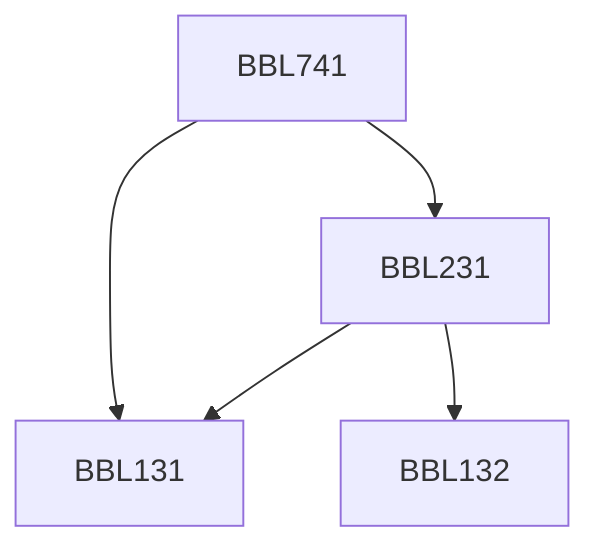

**Credits:** 3 (3-0-0)

**Prerequisites:** [[/Biochemical Engineering and Biotechnology/BBL131|BBL131]] [[/Biochemical Engineering and Biotechnology/BBL231|BBL231]] or Masters’ degree in Bioscience

#### Description
Introduction and aim; Basic structural principles of proteins-amino acids; Motifs of protein structure and their packing: alpha domain, alpha/Beta domain, Antiparallel B structures; Protein folding and assembly – protein folding pathways for single and multiple domain proteins; Recovery of active proteins from inclusion bodies; Structure prediction-structural classes, secondary and tertiary protein structure prediction; Sequence homology searches; Strategies for protein engineering – random, site-directed, case studies; Drug-protein interactions and design, Rational protein design.

### Prerequisite Tree

