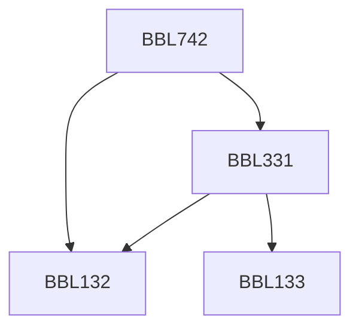

**Credits:** 4 (3-0-2)

**Prerequisites:** [[/Biochemical Engineering and Biotechnology/BBL132|BBL132]], [[/Biochemical Engineering and Biotechnology/BBL331|BBL331]] or Bachelor’s degree in Engineering or Masters’ degree in Science

#### Description
Qualitative and quantitative characterization of wastes; Waste disposal norms and regulations; Indian regulations; Principles of biological treatment; Aerobic and anaerobic biological wastewater treatment systems; Suspended and attached cell biological wastewater treatment systems; Biological nutrient removal; Treatment plant design calculations; Treatment and disposal of sludge; biological means for stabilization and disposal of solid wastes; Treatment of hazardous and toxic wastes; Degradation of xenobiotic compounds; bioremediation. Laboratory: Characterization of wastes; Design calculations for various types of wastes using various types of biological processes.

### Prerequisite Tree

