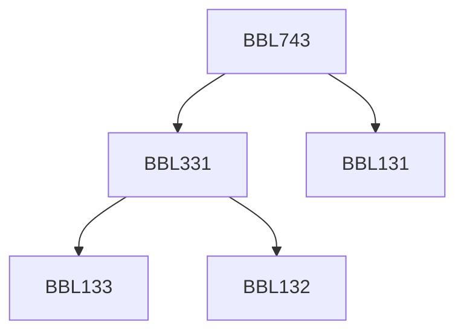

**Credits:** 3 (2-0-2)

**Prerequisites:** [[/Biochemical Engineering and Biotechnology/BBL131|BBL131]], [[/Biochemical Engineering and Biotechnology/BBL331|BBL331]] or Masters’ degree in Bioscience

#### Description
Need for high resolution separation for biologicals; Difficulties with traditional methodologies; Affinity precipitation and partitioning; MF/ UF/NF for high resolution separation; chromatography techniques; Affinity chromatography and electrophoresis, Separation by gene amplification (PCR), Molecular imprinting.

### Prerequisite Tree

