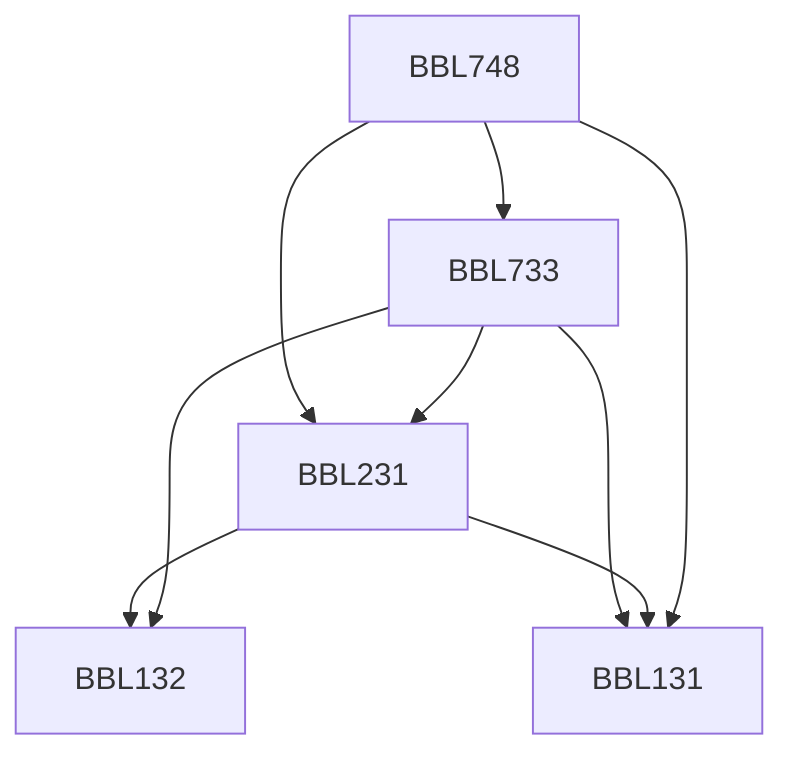

**Credits:** 4 (3-0-2)

**Prerequisites:** [[/Biochemical Engineering and Biotechnology/BBL131|BBL131]], [[/Biochemical Engineering and Biotechnology/BBL231|BBL231]], [[/Biochemical Engineering and Biotechnology/BBL733|BBL733]]

#### Description
Microarray technology, Basic digital imaging and image processing, Probabilities, common distributions, Bayes’ theorem, Analyzing microarray data with classical hypothesis testing, Analysis of variance, Experimental Design, Analysis and visualization tools: Box plots, Scatter plots, Histograms, Cluster Analysis: one-way, two-way, Graphic, Methods for selection of differentially regulated genes, Hypothesis driven experiments using focused microarrays, Biological interpretation, Commercial software available.

### Prerequisite Tree

