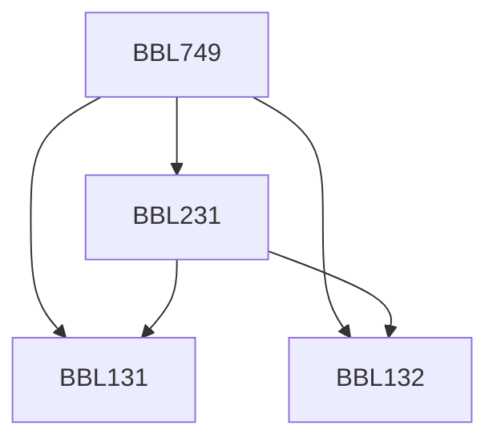

**Credits:** 4.5 (3-0-3)

**Prerequisites:** [[/Biochemical Engineering and Biotechnology/BBL131 | BBL131]], [[/Biochemical Engineering and Biotechnology/BBL132 | BBL132]], [[/Biochemical Engineering and Biotechnology/BBL231 | BBL231]]

#### Description 
This course provides students with a deeper understanding of cancer biology and is heavily focused on experiments: Topics include: Cancer Biology Overview, Types of Cancer, Causes for cancer, Oncogenes and Tumor suppressors, Cell Cycle and Regulation, Cell Differentiation, Cell Death Pathways (Apoptosis, Autophagy), Necrosis, Cell Senescence, Cell Adhesion and Motility, Cancer Epigenetics and sRNAs, Cancer Genome instability, Tumor Immunity, Growth Signaling pathways, Tumor angiogenesis, Cancer Stem Cell, Diagnosis, prognosis and treatment of cancer.

Laboratory: Experiments on Cell cycle, Differentiation, Necrosis and Apoptosis, Senescence, Anchorage Independence, Cell Migration and Invasion, MicroRNAs, Stem cell, Fluorescence Microscopy.

### Prerequisite Tree

