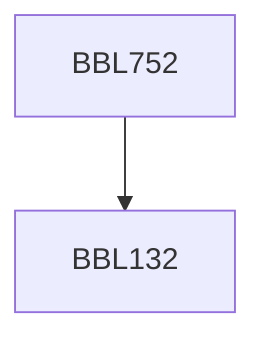

**Credits:** 3 (3-0-0)

**Prerequisites:** [[/Biochemical Engineering and Biotechnology/BBL132|BBL132]]

#### Description
Microbial diversity, interactions, communities; Microbial community structure vs. function; Microbiomes in natural ecosystems: terrestrial and aquatic, extreme environments; Interactions of microbiomes with higher organisms (Humans and Plants); Microbial functions in biogeochemical cycles; Methodological advances in Microbial Ecology: Novel strategies for culturing the “unculturables”, Era of “Omics”, Quantitative and qualitative methods for characterization of microbial communities; Role of microbial ecology in crucial environmental issues, viz. climate change, sustainability, pollution.

### Prerequisite Tree

