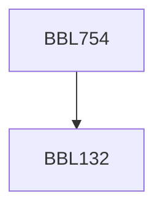

**Credits:** 3 (3-0-0)

**Prerequisites:** [[/Biochemical Engineering and Biotechnology/BBL132|BBL132]]

#### Description
Course will cover nature of light-matter interaction, fundamentals of absorbance, fluorescence and scattering. All the components in spectroscopic and imaging technologies i.e., light source to detectors will be discussed. Properties of optical probes, various spectroscopic and imaging techniques used to study biological samples. Including; confocal, TIRF, non-linear, in vivo, super resolution and single molecule imaging.

### Prerequisite Tree

