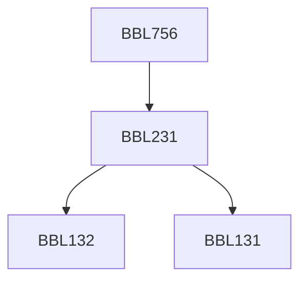

**Credits:** 3 (3-0-0)

**Prerequisites:** [[/Biochemical Engineering and Biotechnology/BBL231|BBL231]]

#### Description
Plasmid nomenclature, classification, replication, segregation, incompatibility, stability, host range, significance in environment, health and biotechnology.

### Prerequisite Tree

