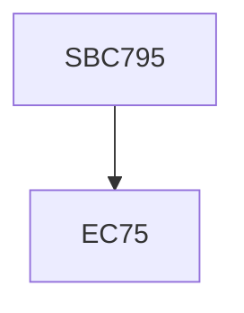

**Credits:** 0.5 (0-0-1)

**Prerequisites:** EC 75

#### Description
The course is aimed at giving the student a forum to periodically present their research, to critique the research of colleagues and learn about the best research in their fields. Discussions will be held on scientific methodology and inculcated with a value system for pursuing a career in science. Activities will be carried out in workshop mode.

### Prerequisite Tree

