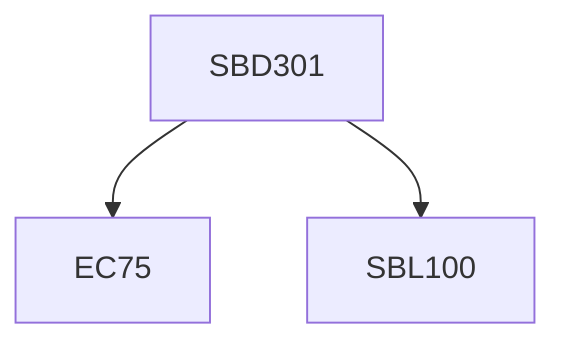

**Credits:** 3 (0-0-6)

**Prerequisites:** [[/Biological Sciences/SBL100|SBL100]] and EC 75

#### Description
Systems Biology, Plant Molecular Biology, Bioprospecting, Tissue culture and Developmental Biology, Virology, Structural Biology, Cell Biophysics, Cellular Signalling, Protein folding and misfolding, Computational Biology.

### Prerequisite Tree

