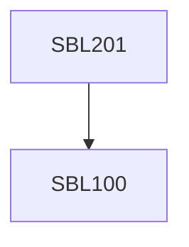

**Credits:** 3 (3-0-0)

**Prerequisites:** [[/Biological Sciences/SBL100|SBL100]]

#### Description
Introduction to Genomics, Proteomics, Metabolomics & Cellomics; Size vis-à-vis packaging and replication challenges; Biomolecular architecture and assemblies leading to function; Immortal cells and aging; Minimalist genomes & designer genomes; Molecular engines; Proteins as nanobiomachines; Network circuits for genome organization and protein-protein interactions, date hubs, party hubs, structure-function axioms; Biochemical cycles and feedback loops, Omics applications; Forensics; Drug targets.

### Prerequisite Tree

