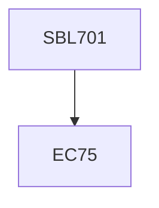

**Credits:** 3 (3-0-0)

**Prerequisites:** EC 75

#### Description
Probability and Set theory: Application to biological data, Random variables: Individuals vs. populations in biological systems, Classification of data: “Discreteness or Continuity” in biological evolution, Distributions, Descriptive statistics, Inferential statistics, Analysis of variance (ANOVA), ANOVA-advanced concepts, Power analysis of variance, Regression and Correlation, Count/Frequency data. MATLAB based assignment activities will be designed for data simulation and analysis corresponding to the covered lecture material.

### Prerequisite Tree

