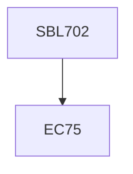

**Credits:** 3 (3-0-0)

**Prerequisites:** EC 75

#### Description
Overview and history of systems biology; Basic elements of molecular biology – DNA and protein, the genetic code, transfer RNA and protein sequences and control of gene expression; Signal transduction – signaling pathways and cascades, information processing and transmission, pathway dynamics; Trees and sequences – graphs, connectivity, trees, flows in networks; Elements of process control – feedback, feed forward and cascade control, dynamics of closed loops, analogies with control of gene expression; Examples of transcription networks, determination of simple motifs that are repeated in genetics; guidelines for analyzing genetics circuits, layouts and representations, circuit dynamics; modeling, simulation and prediction of cellular events, micro-macro relations; Experimental methods in systems biology, creation of directed information, existing databases; platforms and applications; Case studies from literature – circadian clock, metabolic networks, gene circuit design; New frontiers.

### Prerequisite Tree

