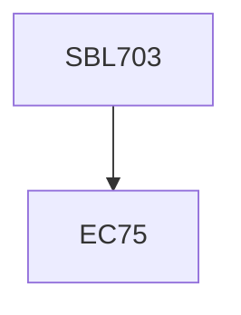

**Credits:** 3 (3-0-0)

**Prerequisites:** EC 75

#### Description
Chemistry of biological structure, function and information flow, Cellular compartmentalization and molecular organization of organelles, Properties and growth of HeLa, Jurkat, SF9 etc.; De-novo synthesis of organelles versus templated replication, Microtubule, microfilament and intermediate filaments; Transport of biomolecules; Nuclear structure, chromatin packing and transport; Microtubule, action and filament based motile systems, cell-cell recognition and adhesion; Fluorescence, phase contrast, confocal and AFM; Molecular basis of cancer, oncogenes and tumor suppressor genes; cell growth and differentiation.

### Prerequisite Tree

