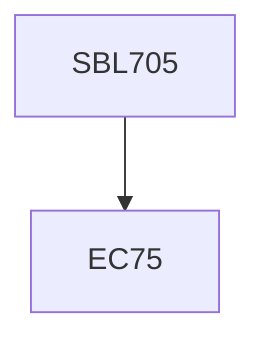

**Credits:** 3 (3-0-0)

**Prerequisites:** EC 75

#### Description
Over-view of protein preparation, modification, maturation; protein- protein interactions in cells, Heat shock proteins and their structure and functions in cells, protein mimicry, assisted protein maturation processes in cells, Protein trafficking and dislocation, protein secretion from cell, kinetics and thermodynamics of protein folding and unfolding reactions, biomarker discovery, ribosome profiling.

### Prerequisite Tree

