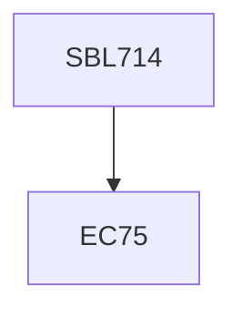

**Credits:** 3 (3-0-0)

**Prerequisites:** EC 75

#### Description
Overview of medicinal plants and their geographical distribution, economics of medicinal plants, KNapSACK family database,metabolic diversity, genomic and transcriptomic profiling, phenomics, antivenoms, plant toxins, bioactive peptides, genetic engineering and molecular biology technologies such as DNA barcoding, DNA chip technology, cDNA, AFLP, microarray, siRNA, antisense, bioanalytics, plant models systems, Nutragenomics, smart and functional foods, Plants based human diseases communicable and noncommunicable diseases, synthetic biology approaches

### Prerequisite Tree

