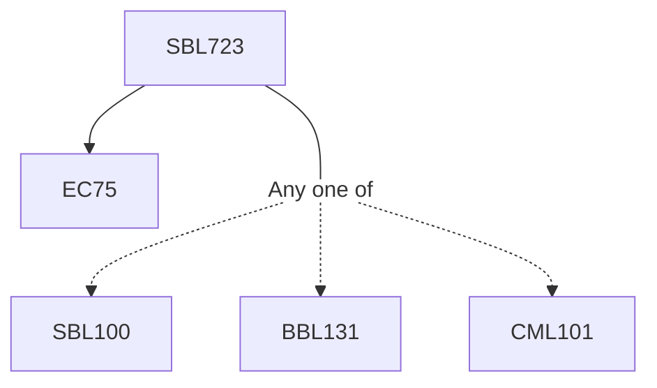

**Credits:** 3 (3-0-0)

**Prerequisites:** EC 75 and [[/Biological Sciences/SBL100|SBL100]]/[[/Biochemical Engineering and Biotechnology/BBL131|BBL131]]/[[/Chemistry/CML101|CML101]]/ Equivalent

#### Description
Neural physiology overview; Elements of excitable cell membrane: ion channels, transporters and cytoskeletal elements; Physical principles of neuronal excitability: Diffusion, Electro-diffusion, Nernst-Plank Equation, Donnan equilibrium, Goldman-Hodgkin-Katz equation; Concept of Resting membrane potential (RMP), maintenance of RMP- Pumps and transporters; Exemplar pump: Na+-K+ ATPase-structure and function; Pores in the membrane: Ion channels; Hodgkin-Huxley model for Na+ and K+ channels; Action potentials; Ion channel structure, function & modulation; Synaptic transmission: vesicle transport and recycling, neurotransmitter release; Neurotransmitter- receptor structure-function; Methods to study ion channels and receptors: Patch-Clamp, planar-bilayer, crystallography and Cryo-EM studies; Action potential generation and conduction: Mechanism and models; Simulation of neural activity

### Prerequisite Tree

