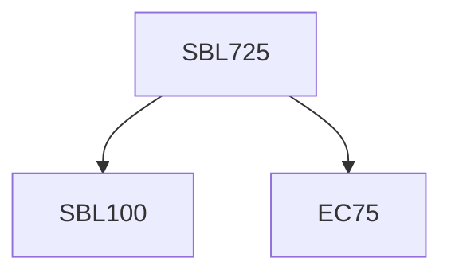

**Credits:** 3 3-0-0)

**Prerequisites:** Pre-requisite(s): EC 75 and [[/Biological Sciences/SBL100|SBL100]] for UG students

#### Description
Introduction to endocytosis and intracellular trafficking – Structure, function and dynamics of Clathrin-mediated endocytosis; Clathrin- independent endocytosis; Receptor-mediated endocytosis; Traffic through endocytic and secretory pathway; Regulation of intracellular trafficking by vesicle fusion; Endosomal system and sorting; Biogensis of endosomes and lysosomes; Functions of Rab GTPases in vesicle fusions; Role of SNAREs in phagosome maturation; Modulation of phagosome maturation by intracellular pathogens: Mycobacterium;

Legionella; Salmonella etc.; Intracellular trafficking and antigen presentation; Human diseases due to defect in intracellular trafficking: Lysosomal storage disease, Atherosclerosis, Niemann Pick C Diseases, Cancers, Neurodegeneration; Exploiting and endocytosis for nanomedicine.

### Prerequisite Tree

