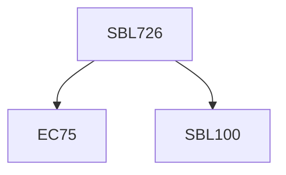

**Credits:** 3 3-0-0)

**Prerequisites:** Pre-requisite(s): EC 75 and [[/Biological Sciences/SBL100|SBL100]] for UG students

#### Description
Introduction to molecular motors and biological motor proteins, historical perspectives, basics principles and broad functions; Polymerization motors: actin, tubulin and intermediary filaments- their structure-function, dynamics – from in-vivo and in-vitro studies and regulation; Force generators: Myosins, dyneins and Kinesisn – their structure-function and reulation. Rotational motors – FoF1ATP synthase and bacterial flagella (structure and function). Eukaryotic Cilia/flagella; DNA helicase and polymerase; Viral assembly – with specific examples of bacteriophages and retroviruses; recent advance (research articles) on organelle transport; Nuclear motors; Molecular motors associated with disease – with emphasis on myosin, dynein and kinesin; Methodologies used to study biological motor proteins; Biological motors in futuristic design.

### Prerequisite Tree

