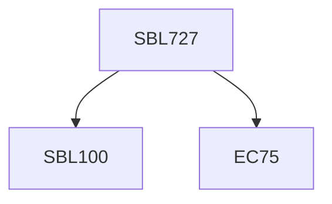

**Credits:** 3 3-0-0)

**Prerequisites:** EC 75 and [[/Biological Sciences/SBL100|SBL100]] for UG students

#### Description
Developmental Anatomy; Cellular identity, differentiation, and competence; Differential gene expression; Concept of models organisms; Signalling mechanisms controlling cell fate and patterning; Cell cycle and programmed cell death; Metabolic regulation of cell fate decisions; Current technologies to reprogram cellular identity and its implications for therapeutic applications; Genetic/developmental mechanisms of birth defects and human diseases; Regulation of cellular identity in cancer; Mechanisms of protein homeostasis in health, aging and disease, Maintenance, repair and replacement of diseased and damaged tissues; Microbiome in health and disease; Omics in Health and Disease.

### Prerequisite Tree

