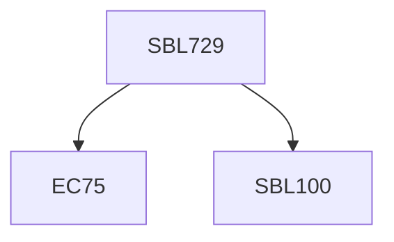

**Credits:** 3 (3-0-0)

**Prerequisites:** [[/Biological Sciences/SBL100|SBL100]] and EC75 for UG students

#### Description
Tumor microenvironment; tumor heterogeneity - both inter and intra- tumoral heterogeneity; intrinsic and extrinsic factors influencing tumor heterogeneity; cancer cell plasticity – evolving theories of cancer sternness or tumor-initiation; cancer evolution - factors influencing this change and their impact on therapy; cancer metabolism - oncometabolites, metabolic exchange and metabolic circuit rewiring in different regions of tumors; metabolic symbiosis between cancer and stromal elements; microbiome influence on cancer (a new emerging hallmark of cancer); immuno-oncology - immunophenotyping during cancer, cancer mediated immune evasion and exhaustion and their impact on immunotherapy; cancer invasion and metastasis - epithelial to mesenchymal and mesenchymal to epithelial transition; metastatic dissemination mechanism and colonization/homing; modern tools in cancer biology – single cell sequencing, metabolomics, multi-omics; current approved drugs, combinatorial therapy, immunotherapy - and challenges ahead.

### Prerequisite Tree

