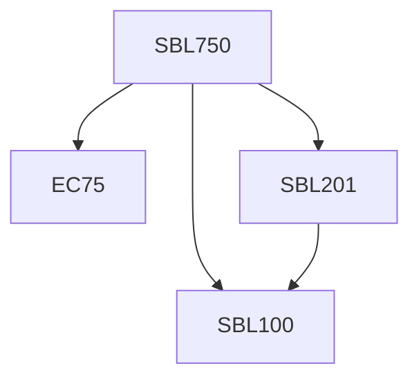

**Credits:** 3 (3-0-0)

**Prerequisites:** Pre-requisite(s): [[/Biological Sciences/SBL100|SBL100]] and [[/Biological Sciences/SBL201|SBL201]] (or equivalent) and EC 75

#### Description
Overview of quantitative biology; Biomolecules - a study of how information is code in molecules - DNA, RNA and proteins, information representation; Molecular sequences - the alignment problem, PAM and BLOSUM matrices, applications - global, local and overlap alignment; Gene prediction - computational gene finding, ab-initio methods, comparative methods; Molecular evolution - molecular clock, explicit models and evolutionary rate estimation; Population genetics - polymorphism, genetic diversity and Neutral theory; Testing evolutionary hypothesis; Genetic circuits - motifs search, satio- temporal logic, methods of analyses; Protein structure prediction, protein-protein interaction networks, drug target identification, Biological network dynamics; Biological pattern formation; Self organization in biology.

### Prerequisite Tree

