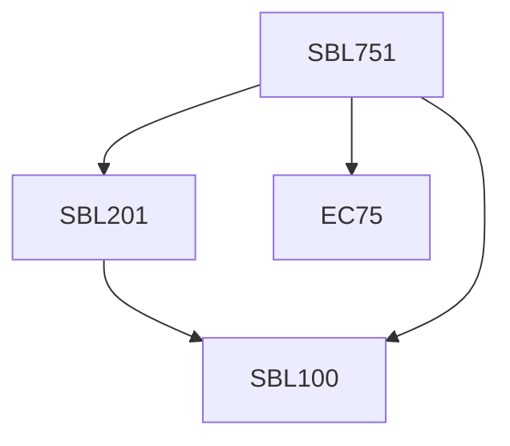

**Credits:** 3 (3-0-0)

**Prerequisites:** Pre-requisite(s): [[/Biological Sciences/SBL100|SBL100]] and [[/Biological Sciences/SBL201|SBL201]] (or equivalent) and EC 75

#### Description
Protein conformation, dynamics and function, Enzyme activity, Biomolecular interactions in cell, biomolecular assemblies in the cell, Generation and storage of metabolic energy, Biosynthesis of macromolecular precursors like, amino acids, lipids, hormones, nucleotides, Characterisation and identification of cells, Genes, genomics and chromosomes, Genetic material, DNA replication, Repair, Translation, Mutagenesis, mutations and mutants, Plasmid and transposable element, Recombinant DNA and genetic engineering, Protein targeting into membranes and organelles, Vesicular traffic, secretion, and endocytosis, Cellular organization of movement, microtubules, Eukaryotic cell cycle, functions and mode of action of nucleus, Nerve cells, Immune response, Evolution of cells, prebiotic synthesis, RNA catalysis, evolution of gene structure, Epigenetics, Non-coding RNA, Hologenome.

### Prerequisite Tree

