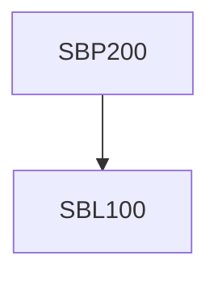

**Credits:** 2 (0-0-4)

**Prerequisites:** [[/Biological Sciences/SBL100|SBL100]]

#### Description
Biosafety lab practices – use of lab coats, gloves, safety goggles, eye wash, shower, chemical and biological waste disposal; Buffers in biology– Preparation of standard biological buffers, buffering capacity and pKa of buffers, biomolecules such as enzymes, whole cells and plant tissues in different buffering conditions; Observing cell surface and intracellular contents using light and fluorescence microscopy, “autofluorescence” of cells, real-time video microscopy of motile cells, cell growth and division; Plant genomic DNA isolation; Protoplast isolation and viability; Computer Modeling-From Genome Sequence to Protein Sequence and structure to screening for a “Hit” Molecule.

### Prerequisite Tree

