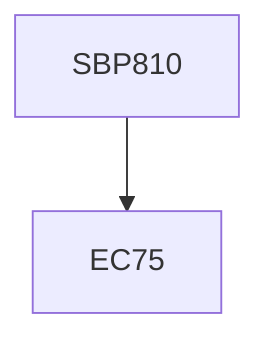

**Credits:** 2 (0-0-4)

**Prerequisites:** EC 75

#### Description
Particle sizing, biological and biomolecular visualization tools, advanced and analytical spectrometry, cell and molecular separation techniques, DNA and protein interaction techniques, membrane interaction and signalling, bioreactors, tissue culture, transgene technology, electrophysiology methods.

### Prerequisite Tree

