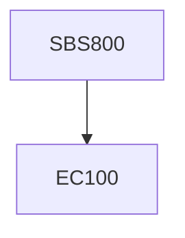

**Credits:** 3 (0-3-0)

**Prerequisites:** EC 100

#### Description
The course is aimed at providing the student an opportunity to pursue a special research topic. A research topic assigned and mutually agreed upon by the faculty and student. Registration will require the submission of a proposal through the research committee on the topic clearly delineating the objectives to be achieved.

### Prerequisite Tree

