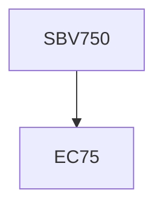

**Credits:** 1 (1-0-0)

**Prerequisites:** EC 75

#### Description
Introduction to Bioinspiration and biomimetics, Bioinspiration pools marine and terresterial plants and animals, Biomimetic/Bioenabled materials, biomineralisation, Biomimetic ahesives and attachment devices in nature, prosthetics function and design, bioinspired robotics, biomimetic pattern formation, colour and camougflage, photocells, role in agriculture and human health, future prospects in the industry.

### Prerequisite Tree

