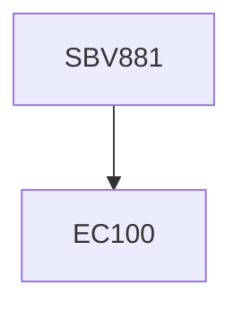

**Credits:** 1 (1-0-0)

**Prerequisites:** EC 100

#### Description
Structural aspects of proteins and nucleic acids, Mechanism of action of biological molecules, Chemical approaches to solve biological problems, Designing chemical tools for addressing problems in biology, Bioconjugate chemistry, Recent developments in these areas.

### Prerequisite Tree

