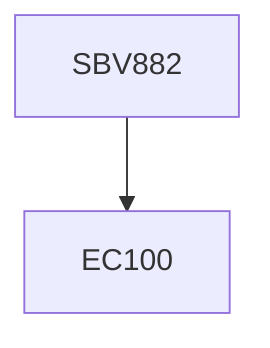

**Credits:** 1 (1-0-0)

**Prerequisites:** EC 100

#### Description
Introduction to the hydrophobic effect, Phospholipid model systems, Cellular membrane asymmetry, Membrane dynamics, Membrane trafficking, Membrane fusion, Membrane proteins (Form and function), Small molecule permeability, Pores channels and transporters, Lipid systems for drug delivery.

### Prerequisite Tree

