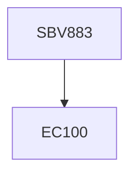

**Credits:** 1 (1-0-0)

**Prerequisites:** EC 100

#### Description
Molecular mechanism of protein misfolding, fate of aggregated proteins in the cell, various protein misfolding disorders in humans, mechanism of action of molecular chaperones in various cells, chaperone assisted suppression of protein misfolding.

### Prerequisite Tree

