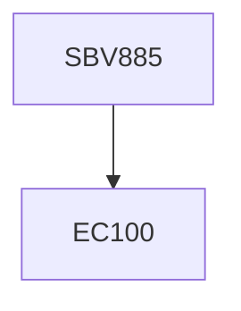

**Credits:** 1 (1-0-0)

**Prerequisites:** EC 100

#### Description
Introduction to protein aggregation (amorphous and amyloid), types of aggregates, difference between aggregation and precipitation; External and internal factors for protein aggregation, pH, temperature and protein concentration effects; hydrophobicity, discordant helices; Structural and conformational prerequisites of amyloidogenesis, predominance of beta-sheet, alpha-helices or random coils of native protein; generic nature of protein folding and misfolding, Cytotoxic intermediates in the fibrillation pathway, Oxidative stress and protein deposition disease, Protein aggregation, ion channel formation, and membrane damage, Recent trends in prevention of amyloidosis; drugs, antibodies, combination therapy.

### Prerequisite Tree

