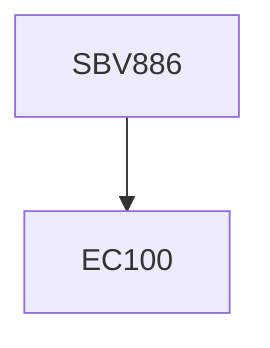

**Credits:** 1 (1-0-0)

**Prerequisites:** EC 100

#### Description
Introduction to modelling of biological systems – history, types of models, macroscopic phenomena, modelling of cellular systems; hierarchy in information transmission and utilization, interaction between different levels of information leading complex behaviour; robustness of cellular systems and its significance; molecules that transmit signals, role of signaling in regulation of cellular functions, gene regulation; signal transduction – evolution and history; first messengers and receptors, GTP-binding proteins; Calcium Signaling – free, bound and trapped calcium, mechanisms regulating calcium concentration, calcium changes in single cells; protein phosphorylation as a switch, protein kinase A, protein kinase C, structure of signaling pathways, extracting motifs from pathways, relating motifs to observations; dynamics and periodicity in signaling pathways.

### Prerequisite Tree

