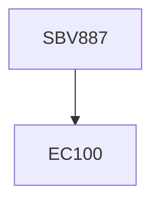

**Credits:** 1 (1-0-0)

**Prerequisites:** EC 100

#### Description
Bring about awareness of the challenges in Genomics, Proteomics, Metabolomics and Structural Biology.

### Prerequisite Tree

```mermaid
flowchart TD
SBV887-694[SBV887]
SBV887-694 --> EC100-694[EC100]

classDef empty height:17px, fill:transparent, stroke:transparent;
classDef trueEmpty height:0px, width:0px;
```