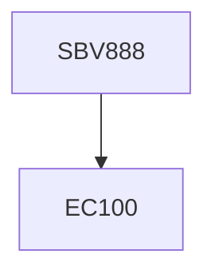

**Credits:** 1 (1-0-0)

**Prerequisites:** EC 100

#### Description
Teach students various methods for target identification, and applications QSAR and molecular modelling in drug discovery.

### Prerequisite Tree

