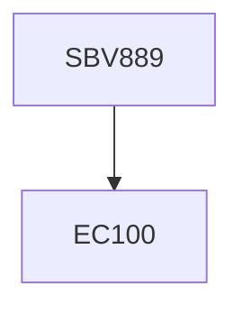

**Credits:** 1 (1-0-0)

**Prerequisites:** EC 100

#### Description
Introduction to diagnostic virology – direct and indirect methods, specimens and window period; Microscopy – light microscopy, electron microscopy, and fluorescence microscopy in virus identifications; Methods of virus isolation – cell culture, embryonated egg inoculation and animal inoculation; Viral antigen detection – methods, assay characteristics, rapid antigen identification techniques; Detection of viral antibodies – methods, role of quantitative measurements, class- specific immunoglobulin detection; Viral nucleic acids – amplification, detection and quantitation methods; Molecular epidemiology of viral infections – high throughput methods; Identifying antiviral resistance – genotypic and phenotypic approaches; Quality control in diagnostic virology – internal and external quality control, international standards, and Shewhart control charts.

### Prerequisite Tree

