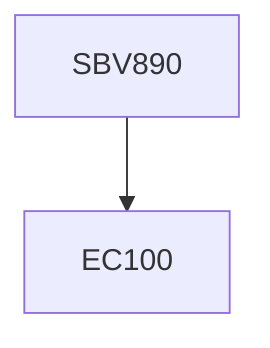

**Credits:** 1(1-0-0)

**Prerequisites:** EC 100

#### Description
Kinetoplastid diseases, transmission, clinical features, immune evasion, treatment, antimicrobial chemotherapy, drug resistance, cross – resistance, Leishmania, promastigotes and amastigotes, procyclic and metacyclic, macrophage, interaction with sand fly, cytokine response, transmission, syndromes associated with leishmaniasis, microtubules in kinetoplastida, dynamics and posttranslational modifications, drug interactions, resistance against tubulin binding agents, arsenite resistance in Leishmania, transporters in kinetoplastid protozoa and drug targets, leishmanial glucose transporters, function of histone deacytylases in kinetoplastid protozoa, DNA – topoisomerases in Leishmania, a possible therapeutic target, exoproteome of leishmania, importane and its application in Leishmania.

### Prerequisite Tree

