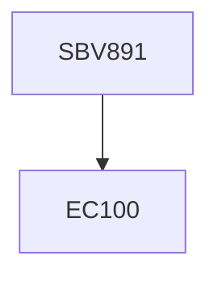

**Credits:** 1 (1-0-0)

**Prerequisites:** EC 100

#### Description
Introduction to the virus life cycle; host cell surface molecules utilized as virus receptors, mechanism of cellular membrane penetration for enveloped and non-enveloped animal viruses, cellular entry of bacteriophages and plant viruses; icosahedral and helical capsids, disassembly and transport of genome to the replication site, process of replication, modification of cellular organelles and hijacking of host cell resources; site and manner of progeny virus assembly ; lytic and lysogenic viruses; virus egress and involvement of the host secretory pathway; host defence mechanisms, virus strategies to evade host immune system, antiviral therapies and drug discovery.

### Prerequisite Tree

