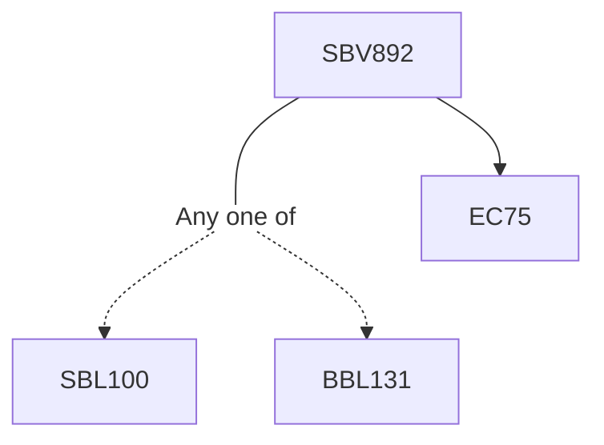

**Credits:** 1 (1-0-0)

**Prerequisites:** EC 75 with [[/Biological Sciences/SBL100 | SBL100]]/ [[/Biochemical Engineering and Biotechnology/BBL131 | BBL131]]

#### Description 
Overview of neuronal physiology; Ion channels and receptors of excitable cell membrane; Ion channel properties: Permeability, Selectivity, Gating and Rectification; Nernst-Plank and Goldman- Hodgkin-Katz equations; Classification of ion channels and receptors; Structure and function studies of ion channels and receptors: voltage-gated Na+ and K+ channels, ligand-gated acetylcholine receptor channel, mechano-gated mscL and Piezo channels; Allosteric modulation of ion channels: theories and application; Ion channel and receptor pharmacology; Methods to study ion channels and receptors: Patch-Clamp, planar-bilayer, crystallography and Cryo-EM studies; Simulation of single channel activity and macroscopic currents from kinetic modeling.

### Prerequisite Tree

