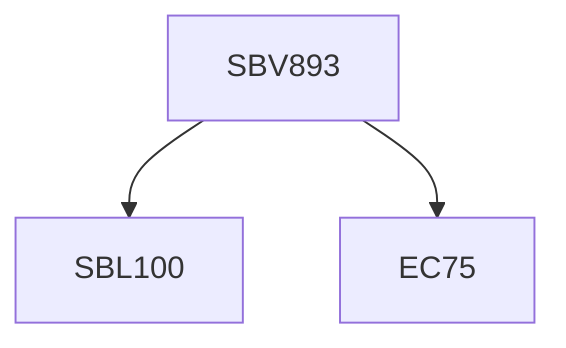

**Credits:** 1 (1-0-0)

**Prerequisites:** Pre-requisite(s): EC 75 with [[/Biological Sciences/SBL100|SBL100]] or Equivalent

#### Description
Introduction to differentiation including concepts of totipotency, pluripotency (stem cell), multipotency. Examples of the fertilized egg, somatic stem cells and plant callus will be included. Differentiation vis-a-vis cellular proliferation. Embryonic differentiation and the formation of the three germ layers. Fate specification by growth factors, concept of microenvironment and mechanotransduction in differentiation. Examples of the haematopoietic system. Nuclear signatures and differentiation. Cellular reprogramming–concepts and methodologies used including dedifferentiation - induced pluripotent stem cells (iPSC). Differentiation and its association with diseases such as Leukemia. How differentiation may be used in therapy. Differentiation in the large-scale production of specific cell types. Future perspectives.

### Prerequisite Tree

