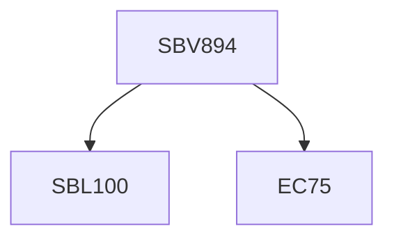

**Credits:** 1 (1-0-0)

**Prerequisites:** EC 75 and [[/Biological Sciences/SBL100|SBL100]] or Equivalent

#### Description
Introduction to mouse genetics – genotypes, genetic backgrounds and methods; Conventional methods of gene targeting and transgenics – gene delivery into embryonic stem cells or zygotes, gene-traps, breeding strategies; Establishment of cell culture models from mice – Fibroblasts and macrophage cultures, rescue strategies using retro/lentiviral transduction; Gene targeting in cells using CRISPR/ Cas9 - mutations, activation and suppression; In vivo conditional knockout strategies using Cre/lox and Flippase/FRT system; Bone- marrow chimeras; Animal models of human diseases.

### Prerequisite Tree

