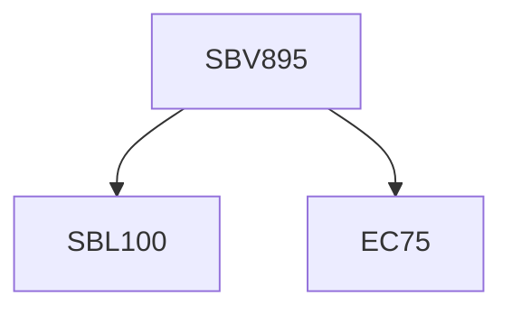

**Credits:** 1 (1-0-0)

**Prerequisites:** EC 75 with [[/Biological Sciences/SBL100|SBL100]] or Equivalent

#### Description
Overview of the principles of animal development: how a single- celled fertilised egg becomes an embryo and then a fully formed adult body; Understanding role of gene networks: how does the control of gene regulation contribute to development? Cell fate and differentiation: overview of the mechanisms of developmental commitment and maintenance of cell differentiation; Patterning: how are the axes formed? Organogenesis: how do developmental processes affect tissue homeostasis and restoration? Growth and post-embryonic development: aging and senescence; Regeneration: how can mechanisms of development be re-employed? Comparative development and evolution: how does comparison between species explain the emergence of new features? Experimental developmental biology: model organisms and the main techniques to study development.

### Prerequisite Tree

